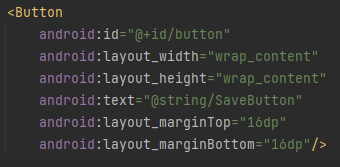
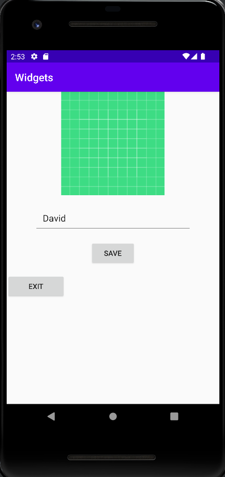

# Rapport

**Skriv din rapport här!**

Första steget var att skapa en layout resurs fil. Efter detta skapade jag
widgets inom layouten genom design view. Därefter modifierade jag koden av 
layout filen så att positionen av widgets såg bättre ut. Widgets jag skapade var
en ImageView, EditText och 2 button widgets. Deras margin attribute modifierade jag
för att ändra position/storlek av widgets. Efter allt detta skrev jag rapport och mellan varje steg
comittade jag.

Exempel på hur jag skapade en string:
<string name="ExitButton">Exit</string>

Hur min button kod såg ut:

Hur program ser ut i emulator:
